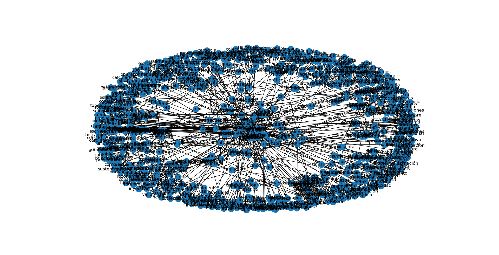

# Práctica 4
Este es el archivo README de la práctica 4.

## Contenido
* relaciones.py: Muestra las relaciones de hiponimia del archivo wikipedia_es_abstracts.txt.

### Ejecutar
Ejecutar archivo relaciones.py

### Resultado
 

## Autor
* **Oscar Chacón** - *Segunda Practica* - <oscar.apple10@gmail.com>