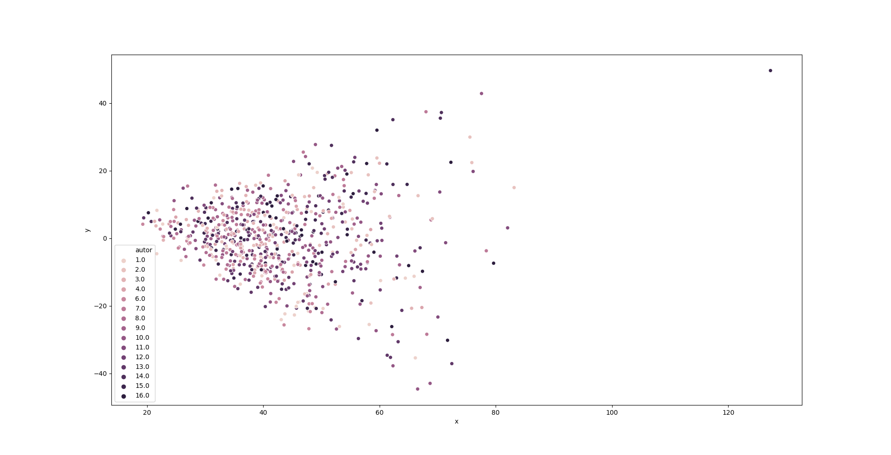
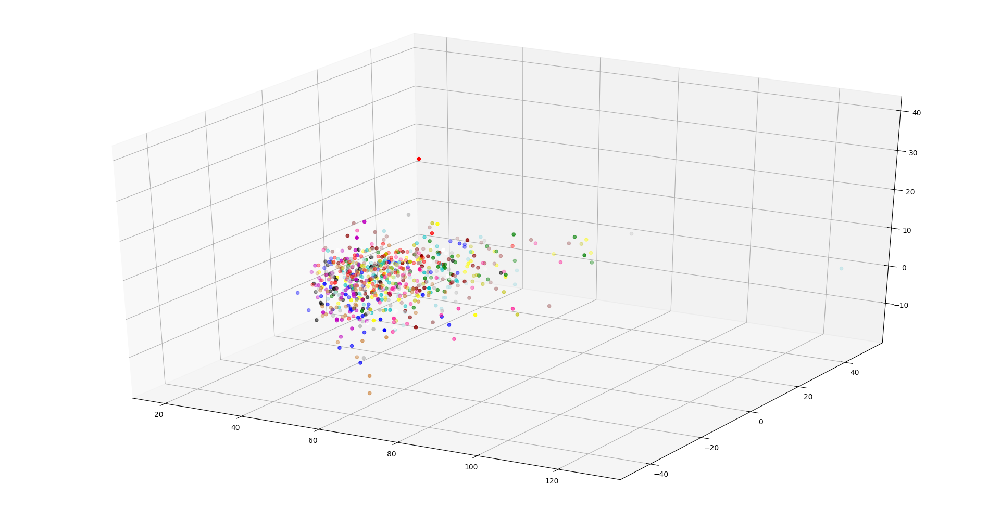

# Práctica 7
Este es el archivo README de la práctica 7.

## Contenido
* main.py: SVD sobre corpus para Atribución de Autoria.
* vectorization.py: Vectorización utilizada en la práctica 6.
* tfidf.py: Funciones para calculo de Matriz TF-IDF

### Ejecutar
Ejecutar archivo main.py

### Características
Las características analizadas son las siguientes:

* Número de comas
* Número de puntos
* Promedio de palabras por oración 
* Cantidad de oraciones por parrafo
* Número de veces que aparece cada palabra del conjunto completo en el texto

### Tópicos más importantes
A continuación se muestra un listado con los tópicos más importantes obtenidos a base de la matriz TF-IDF y la ejecución del SVD:

* Topico 0:
    * Termino: ciudad, Importancia: 7.59E-02
    * Termino: ser, Importancia: 7.22E-02 
    * Termino: político, Importancia: 7.07E-02
    * Termino: económico, Importancia: 7.00E-02
    * Termino: nuevo, Importancia: 6.94E-02
    * Termino: méxico, Importancia: 6.91E-02
    * Termino: poder, Importancia: 6.85E-02
    * Termino: año, Importancia: 6.71E-02
    * Termino: mexicano, Importancia: 6.62E-02
    * Termino: hacer, Importancia: 6.60E-02
* Topico 1:
    * Termino: confiable, Importancia: 4.26E-01
    * Termino: indicador, Importancia: 3.79E-01
    * Termino: disponible, Importancia: 3.28E-01
    * Termino: porfiriato, Importancia: 3.16E-01
    * Termino: cuadrar, Importancia: 3.13E-01
    * Termino: desempeñar, Importancia: 2.86E-01
    * Termino: cifrar, Importancia: 2.76E-01
    * Termino: ofrecer, Importancia: 2.65E-01
    * Termino: economía, Importancia: 1.93E-01
    * Termino: 1, Importancia: 1.77E-01
* Topico 2:
    * Termino: peldaño, Importancia: 3.50E-01
    * Termino: abrojo, Importancia: 3.50E-01
    * Termino: víbora, Importancia: 1.95E-01
    * Termino: patulea, Importancia: 1.95E-01
    * Termino: nido, Importancia: 1.95E-01
    * Termino: hampa, Importancia: 1.95E-01
    * Termino: fementido, Importancia: 1.95E-01
    * Termino: doliente., Importancia: 1.95E-01
    * Termino: dolencia, Importancia: 1.95E-01
    * Termino: alcázar, Importancia: 1.95E-01
* Topico 3:
    * Termino: vallar, Importancia: 1.21E-01
    * Termino: tula, Importancia: 1.17E-01
    * Termino: mexica, Importancia: 1.15E-01
    * Termino: a.c., Importancia: 1.09E-01
    * Termino: señorío, Importancia: 1.04E-01
    * Termino: alianza, Importancia: 9.87E-02
    * Termino: teotihuacán, Importancia: 9.72E-02
    * Termino: texcoco, Importancia: 9.61E-02
    * Termino: tolteca, Importancia: 9.61E-02
    * Termino: encontrar, Importancia: 8.91E-02
* Topico 4:
    * Termino: cossío, Importancia: 3.70E-01
    * Termino: campillo, Importancia: 3.70E-01
    * Termino: recomendar, Importancia: 3.11E-01
    * Termino: virreinal, Importancia: 2.35E-01
    * Termino: cambio, Importancia: 2.31E-01
    * Termino: cual, Importancia: 2.21E-01
    * Termino: oposición, Importancia: 2.10E-01
    * Termino: colonia, Importancia: 2.08E-01
    * Termino: reinar, Importancia: 1.97E-01
    * Termino: sector, Importancia: 1.73E-01
* Topico 5:
    * Termino: mexica, Importancia: 1.86E-01
    * Termino: señorío, Importancia: 1.64E-01
    * Termino: texcoco, Importancia: 1.61E-01
    * Termino: alianza, Importancia: 1.60E-01
    * Termino: tributar, Importancia: 1.39E-01
    * Termino: subordinar, Importancia: 1.35E-01
    * Termino: tepaneca, Importancia: 1.34E-01
    * Termino: cossío, Importancia: 1.25E-01
    * Termino: campillo, Importancia: 1.25E-01
    * Termino: tenochtitlan, Importancia: 1.23E-01
* Topico 6:
    * Termino: heterogeneidad, Importancia: 2.84E-01
    * Termino: visionar, Importancia: 2.55E-01
    * Termino: integrador, Importancia: 2.55E-01
    * Termino: modernidad, Importancia: 2.44E-01
    * Termino: humanismo, Importancia: 2.43E-01
    * Termino: homogeneidad, Importancia: 2.42E-01
    * Termino: religiosidad, Importancia: 2.39E-01
    * Termino: visión, Importancia: 2.27E-01
    * Termino: positivismo, Importancia: 2.23E-01
    * Termino: múltiple, Importancia: 2.22E-01
* Topico 7:
    * Termino: plaza, Importancia: 2.54E-01
    * Termino: tambalearse, Importancia: 2.02E-01
    * Termino: perfecto., Importancia: 2.02E-01
    * Termino: canales., Importancia: 2.02E-01
    * Termino: calor, Importancia: 2.02E-01
    * Termino: bullicioso, Importancia: 2.02E-01
    * Termino: bullicio, Importancia: 2.02E-01
    * Termino: borracho, Importancia: 2.02E-01
    * Termino: aglomeración, Importancia: 2.02E-01
    * Termino: asalto, Importancia: 1.81E-01
* Topico 8:
    * Termino: salinista, Importancia: 2.69E-01
    * Termino: indemne, Importancia: 2.69E-01
    * Termino: ende, Importancia: 2.41E-01
    * Termino: parecer, Importancia: 2.35E-01
    * Termino: presidencialismo, Importancia: 2.30E-01
    * Termino: duro, Importancia: 2.09E-01
    * Termino: régimen., Importancia: 2.00E-01
    * Termino: someter, Importancia: 1.86E-01
    * Termino: probar, Importancia: 1.79E-01
    * Termino: sexenio, Importancia: 1.79E-01
* Topico 9:
    * Termino: miedo, Importancia: 2.30E-01
    * Termino: intervencionista, Importancia: 1.57E-01
    * Termino: activación, Importancia: 1.57E-01
    * Termino: johnson, Importancia: 1.43E-01
    * Termino: articulación, Importancia: 1.41E-01
    * Termino: desestabilización, Importancia: 1.37E-01
    * Termino: reflejo, Importancia: 1.31E-01
    * Termino: estrategia, Importancia: 1.23E-01
    * Termino: reaccionar, Importancia: 1.20E-01
    * Termino: plaza, Importancia: 1.16E-01

### Representación 2D
A continuación se muestra una representación 2D basada en las características descritas anteriormente sobre el mismo corpus, para ello se tomaron los dos tópicos más importantes de todos los textos. Cada autor se visualiza de un color diferente.

 

### representación 3D
A continuación se muestra una representación 3D basada en las características descritas anteriormente sobre el mismo corpus, para ello se tomaron los tres tópicos más importantes de todos los textos. Cada autor se visualiza de un color diferente.

 

## Autor
* **Oscar Chacón** - *Séptima Practica* - <oscar.apple10@gmail.com>